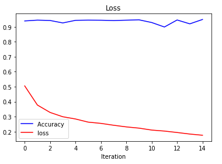

# Introduction

This page presents an end-to-end network intrusion detector based on HAST-IDS model. Unlike HAST-IDS which uses one-hot vectors as input, our model uses pretrained embeddings, taking advantage of the large amount of unlabeled data. Experiments on ISCX 2012 dataset show competitive results. Additionally, we argue that our model is superior to the state-of-art model when dealing with few-shot or zero-shot attacks.(work in progress)
- input

One example of input bytes is as follows:

'4500 0034 0000 4000 4006 fd7c c0a8 057a 83ca f35a 0016 1b1e a0fc abfa 2d03 c045 8012 16d0 c575 0000 0204 05b4 0101 0402 0103 0307 4500 0028 b2ee 4000 4006 4a9a c0a8 057a 83ca f35a 0016 1b1e a0fc abfb 2d03 c045 5011 002e 1ce9 0000 0000 0000 0000 4500 0028 0000 4000 4006 fd88 c0a8 057a 83ca f35a 0016 1b1e a0fc abfb 0000 0000 5004 0000 0a6d 0000 0000 0000 0000 4500 0028 0000 4000 4006 fd88 c0a8 057a 83ca f35a 0016 1b1e a0fc abfc 0000 0000 5004 0000 0a6c 0000 0000 0000 0000 4500 0028 0000 4000 4006 fd88 c0a8 057a 83ca f35a 0016 1b1e a0fc abfc 0000 0000 5004 0000 0a6c 0000 0000 0000 0000'

- output

The output will be classification of traffic as normal or BFSSH or HttpDoS or DDoS or Network Inflit 

- example of this task

# Results
- Results of intrustion detection

NSL-KDD datasets
  - We have implemented CNN, RNN, GRU and LSTM model on this datasets
  - CNN is giving 98.10 percentage of accuracy while other model are outporforming more than 99 percentage of accuracy
  - All the codes are updated
  
ISCX 2012:
  - Using image as a input datasets, the CNN model provides around 95 percentage of accuracy.
  
  
  - Using raw bytes text as input datasets and word2vec skip gram model as embedding layer with two layers of LSTM and one linear layer. Experiment is going on.. 
  
- Results of pretraining(latest loss/loss curve)

# Details

### Dataset(ISCX 2012)

- Dataset introduction

The ISCX data set was created in 2012 by capturing traffic in an emulated network environment over one week. The authors used a dynamic approach to generate an
intrusion detection data set with normal as well as malicious network behavior. The 7-day simulation dataset consists of 3 days of attack-free traffic and 4 days of mixed benign and malign traffic. This datasets contins four types of attack, they are HTTP Denial of Service (DoS), Infiltrating the network from inside, Distributed Denial of Service (DDoS), and Brute Force SSH. The simulation was created to simulate and mimic user behaviour activity. Profile-based user behaviour was created by executing a user-profile that synthetically generates at random synchronized times. The dataset came with labelled traffic that could assist the researcher for testing, comparison, and evaluation purposes. The datasets is available at https://www.unb.ca/cic/datasets/ids.html to download. 


- Dataset preprocessing

  - The original datasets contain the 7 days packet capture file in pcap format and also provide the label data in xml format with information of each flow and their tag name. The tag contains whether it is normal or attack information.
  - Therefore to generate the datasets with associated labeling, we need to first convert the single pacp file of each day to multiple pcap file based on flows. 
  - The conversion was done using a script presented in converter folder
  - Each flow pcap file name contains five fields of information. They are source IP, destination IP, source port, destination port and protocol. 
  - Based on this information we match each flow data with provided information and split all the match records into normal and attack groups for each day. 
  - Read all the flow based pcap files and store raw bytes as text using script presented in preprocessing folder.
  - Read all the text files and did preprocessing using script and store as a csv file.


### Data Analysis

- Feature selection

The raw packet datasets contains many different features. But all of the fetures are not equally important for classification of problem. Therefore to check which of the features are plying very important role in classification, we have used NSL-KDD labelled datasets. The NSL-KDD datasets have 41 features but all of the features are not equally important for the prediction. Therefore we have also done some feature engineering jobs which are uploaded under Feature_Engineering folder. We tried different apporach for feature learning. First we performed constant, quasi constant features elimination and than perform feature selection based on corelation coefficient. We have also tried feature selection based on sklearn feature importance method. Instead of selecting the features based on one machine learning feature importnace, we have calculated the feature importance of various model and than compute the average feature importance. We also tried permutation and recursive feature importance technique as well. We plan to use those feature in raw traffic data later.

The most valuable top 25 features with importance score suggested by experiments are as follows:
  - src_bytes  :  1.8502100012373925
  - same_srv_rate  :  1.1860399920463562
  - dst_host_srv_diff_host_rate  :  1.1551899991285801
  - land  :  1.15294
  - dst_host_same_src_port_rate  :  0.913479999846518
  - dst_host_diff_srv_rate  :  0.835320000373125
  - root_shell  :  0.8237000000098534
  - is_host_login  :  0.67615
  - su_attempted  :  0.62306
  - num_failed_logins  :  0.47961999999247495
  - dst_host_srv_serror_rate  :  0.4657000000626594
  - srv_serror_rate  :  0.45968000034451484
  - protocol_type  :  0.45852999968826774
  - dst_host_same_srv_rate  :  0.43416000021040446
  - srv_rerror_rate  :  0.42654999998383225
  - dst_host_srv_rerror_rate  :  0.4136999999279529
  - logged_in  :  0.39377000016033653
  - is_guest_login  :  0.38204000001531097
  - count  :  0.3125800000500679
  - dst_host_serror_rate  :  0.27240000028312206
  - wrong_fragment  :  0.23477999959468837
  - serror_rate  :  0.22987000016629694
  - dst_host_rerror_rate  :  0.22221999990001323
  - num_shells  :  0.19520000000106172
  - service  :  0.19111999988496303

### Pretraining

- Model

The word2vec embedding method is used for pretraining the vocabulary. Here we have used the skip gram model with negative sampling for training the most popular voculabory. All the steps are information are provied as follows. 

  - Load the raw bytes datasets with associated classification types
  - Some of the raw bytes are very large in size, therefore we have discarded those rows which size is higher than 50, 000.
  - Split all the byes to each word and count the unique words and their frequency
  - There are 65786 unique words in the datasets
  - As We plan is to apply word embedding before the LSTM model, the 65786 vocab size is very big. Therefore we decided to keep only the top most used 10,000 vocab. 
  - Before training the word2vec model, we first preprocess the data so that only selected vocab will be keeped and other vocab(bytes) are replaced with ‘unknown’ word. 
  - Most of the rows have length around 1000 while some are 50,000. Therefore for these experiments we keep only 1200 length as inputs to model for each row. The rows less than 1200 added ‘0’ as padding and those which are larger trim to size of 1200.
  - Then convert all rows text data into a list of lists.
  - Define the word2vec model parameters for training. The parameters used for processing are as follows
    - min_count=1,
    - window=3,
    - size=300,
    - sample=6e-5,
    - alpha=0.03,
    - min_alpha=0.0007,
    - negative=20,
    - sg=1,
    - compute_loss=True,
    - workers=2
    - The word2vec model is training for 20 epochs and saved for future use.
    - The Word2vec model has two methods to build word embedding, we have used a skip-gram model with negative sampling. 
  


- loss function:

The loss function used in the skip gram model of word2vec is Negative Sampling Loss. After training the model for 20 epoch, The model return the loss of the last epoch is 0. The pretained model and script are presented in word2vec folder. The few shot-lerning and zero-shot learning model is work on progress. 

### Intrusion Detection Model

- Model

The model build for Intrusion Detection is as given below. Here the embedding_model is the pretaind word2vec model. The input to the model is list of byte words

```
class lstm_block(nn.Module):

    def __init__(self, embedding_model, in_channels=1000, hidden_dim=512, hidden_dim2=256, num_payers=2, out_channels=4):
        super(lstm_block, self).__init__()

        self.embds = embedding_model

        self.lstm1 = nn.LSTM(in_channels, hidden_dim, num_payers, batch_first=True, dropout=0.4)
        self.lstm2 = nn.LSTM(hidden_dim, hidden_dim2, num_payers, batch_first=True, dropout=0.4)

        self.fc1 = nn.Linear(hidden_dim2, out_channels)

    def forward(self, x):

        out = self.embds[x]
        
        out = torch.FloatTensor(out)
        out = out.view(1,300, -1)
        
        out, hn = self.lstm1(out)
        out, hn2 = self.lstm2(out)

        out = out[:, -1, :]
        out = out.view(1, -1)
        out = self.fc1(out)
        
        return out
```
- loss function

As the problem is multi level classification, We have used cross entropy loss function. The result will update after experimets is done. 

# References
1. Wang, W., Sheng, Y., Wang, J., Zeng, X., Ye, X., Huang, Y., & Zhu, M. (2017). HAST-IDS: Learning hierarchical spatial-temporal features using deep neural networks to improve intrusion detection. IEEE Access, 6, 1792-1806.

2. Ring, M., Wunderlich, S., Scheuring, D., Landes, D., & Hotho, A. (2019). A survey of network-based intrusion detection data sets. Computers & Security, 86, 147-167.

3. Kamarudin, M. H., Maple, C., Watson, T., & Safa, N. S. (2017). A new unified intrusion anomaly detection in identifying unseen web attacks. Security and Communication Networks, 2017.

# network_traffice_detection

In the case of Intrusion Detection, NSL-KDD is consider as the standard datasets and have been used by many reseacher for their reseach work. 
Therefore we also perform the network traffic classification using various range of deep learning model on NSL-KDD.
The peroformance of model is promising. All the models are uploaded in this repository with proper name.

The NSL-KDD datasets have 41 features but all of the features are not equally important for the prediction. Therefore we have also done some feature engineering jobs which are uploaded under Feature_Engineering folder. We tried different apporach for feature learning. First we performed constant, quasi constant features elimination and than perform feature selection based on corelation coefficient. We have also tried feature selection based on sklearn feature importance method. 
Instead of selecting the features based on one machine learning feature importnace, we have calculated the feature importance of various model and than compute the average feature importance. We also tried permutation and recursive feature importance technique as well. 

Though NSL-KDD is consider as standard datasets, it is also very true that this a old and label data sets with limited number of features. Therefore we have selected another datasets called ISCX 2012 which contains very high volume of raw data. Our plan is to propose various way to present raw data and apply transfer learning and few-shot techniuque with combination of cnn and lstm model. 

In this project we are using ISCX 2012 datasets for classification of network traffic.

Plan:
1. Download the datasets from https://www.unb.ca/cic/datasets/ids.html
2. Convert the single pcap file to multiple pcap files based on flow
3. Seperate the network traffic data accoirding to corresponding tag (Normal, DoS, DDos, BFSSH, INI)
4. Convert each flow of pcap file to text file
5. Make the datasets ready for Few-shot based model
6. Build the model
7. Test the model 
8. Compare the performance with the latest related work
